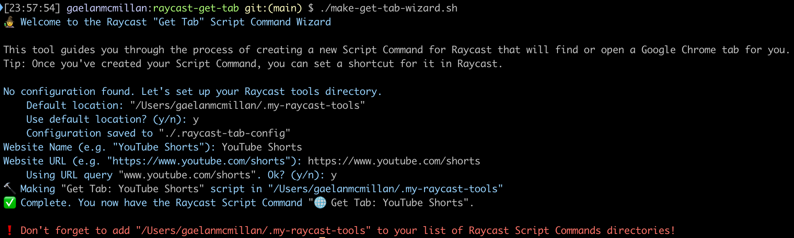

# Raycast "Get Tab"

These are the scripts I use to open and focus Chrome tabs in the same way I open desktop apps, using Raycast.

<details>
<summary>How I use these scripts</summary>

I like having my most used apps on hotkeys.

Prior to getting these scripts together, my Raycast-hotkeyed apps were the following:

| App    | Hotkey |
| ------ | ------ |
| VSCode | ⌃ ⇧ C  |
| Slack  | ⌃ ⇧ S  |
| Chrome | ⌃ ⇧ W  |

(I copied this workflow from [Roger (rog22rz)](https://github.com/rog22rz). Thanks Roger!)

When I pressed my Chrome hotkey, I would almost always looking for a tab I already had open. So, I would either...

1. Open a new tab and navigate to my destination, probably making a duplicate tab, or ...
2. Use Chrome's _Search Tabs..._ (⌘ ⇧ A) to find an existing tab, if muscle memory didn't already take over, or...
3. Grab my mouse and scan across the tab bar, which was invariably so overpopulated with dupes that the best I could do was pick out a familiar favicon.


_The humanity..._

When one's work revolves around many web-based tools, the lack of _Spotlight_-like access to these apps is sorely missed.

That's where these scripts come in. Rather than hotkeying Chrome and following the choreography above, I have just about every letter accessible to my left index finger mapped to a different $(urlToOpen, urlToSearch)$ pair that I can use to either find or open a tab to a given website.

Here are some of my favourites:

| Site                       | Hotkey |                                                                                                                             |
| -------------------------- | ------ | --------------------------------------------------------------------------------------------------------------------------- |
| My current design document | ⌃ ⇧ D  | Great to have this on a hotkey during the research-write cycle.                                                             |
| ChatGPT                    | ⌃ ⇧ G  | One of my most oft-duplicated tabs.                                                                                         |
| SSO Dashboard              | ⌃ ⇧ Q  | _The_ most oft-duplicated tab.                                                                                              |
| Google Meet                | ⌃ ⇧ X  | This one's particularly handy, especially if you have multiple chrome windows stacked on top of eachother during a meeting. |

That's it, really! If web apps are taking the place of desktop apps, I wanna be able to open them with the same convenience.

Hope you can get some use out of these, too.

</details>

## Overview

This project is really just three scripts:

1. **`open-chrome-tab.applescript`**: an osascript utility that finds/opens Chrome tabs given a `url` and `urlQuery`.
2. **`make-get-tab-script.sh`**: a script that stamps out more scripts to invoke (1) (with annotations such that Raycast recognizes them as [Script Commands](https://www.raycast.com/blog/getting-started-with-script-commands)).
3. **`make-get-tab-wizard.sh`**: an interactive utility that invokes (2), making it a little easier to create and manage these scripts.

## Prerequisites

- [Raycast](https://www.raycast.com/)
- Google Chrome (while I haven't tried, I imagine you could adapt `open-chrome-tab.applescript` to work with other browsers...)
- zsh (the default on MacOS, anyway)

## Setup

1. Clone this repository:

   ```bash
   git clone https://github.com/yourusername/raycast-get-tab.git
   cd raycast-get-tab
   ```

## Usage

I've included a couple sample "Get Tab" commands:

- Get Tab: Gmail (`examples/get-tab-gmail.sh`)
- Get Tab: Gemini (`examples/get-tab-gemini.sh`)

These are just zsh scripts with special comment that let Raycast recognize it as a Script Command.

> [!IMPORTANT]
> For these scripts to appear in your Raycast menu, you'll need to [add the `examples/` directory](#adding-raycast-script-command-directories) to your list of Raycast Script Command directories.
> 
> Once you've done that, find the commands via the Raycast menu, or setup a hotkey.

## Creating New "Get Tab" Commands

### Via script

```bash
./make-get-tab-script.sh {Script_Directory} {Website_Name} {URL} {URL_Query}
```

- `Script_Directory` — The path to your raycast scripts directory. This is where this script will generate your new \"get-tab-\*.sh\" script."
- `Website_Name` — The "proper name" of the website, e.g. "Youtube Shorts". Used to title your generated zsh script and Raycast Script Command.
- `URL` — The URL to open when no tab matching the query is found, e.g. "https://www.youtube.com/shorts"
- `URL_Query` — The URL substring to search for when finding an existing tab, e.g. "youtube.com/shorts".

### Via the Wizard (recommended)

Run the wizard and follow the prompts.

```bash
./make-get-tab-wizard.sh
```

#### Wizard Example



> [!TIP]
> If you plan on making lots of "Get Tab" commands, make a zsh alias for the wizard.
> 
> ```bash
> # inside .zshrc
> alias raycast-get-tab="/PATH/TO/raycast-get-tab/make-get-tab-wizard.sh"`
> ```

---
## Adding Raycast Script Command directories
> [!IMPORTANT]
> By default, Raycast will not search your computer for Script Commands.
>
> Go to `Raycast > Settings (⌘+,) > Extensions > Scripts > Add Directories`, then select the script directory you specified in the wizard.
>
> **Now your "Get Tab" Script Commands should be runnable from Raycast.**

---

Shout-out to [Reme (xreme)](https://github.com/xreme) for putting me onto Raycast!
