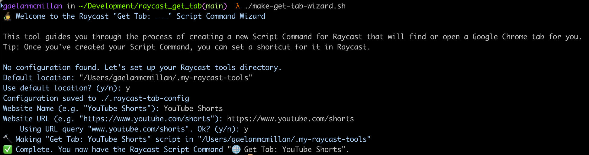

# Raycast "Get Tab: \_\_\_"

Find or open a Chrome tab via Raycast.

## Overview

This project provides a set of scripts that integrate with Raycast to let you open Chrome tabs like you open standalone apps.

- **`open-chrome-tab.applescript`**: the generic utility responsible for finding/opening Chrome tabs
- **`make-get-tab-script.sh`**: a script for making the actual \_Get Tab: \_\_\__ Raycast commands that call \_open-chrome-tab.applescript_
- **`make-get-tab-wizard.sh`**: an interactive utility for making \_Get Tab: \_\_\_\_ commands. Easier to use than the aforementioned script.

## Prerequisites

- [Raycast](https://www.raycast.com/)
- Chrome
- zsh

## Setup

1. Clone this repository:

   ```bash
   git clone https://github.com/yourusername/raycast_get_tab.git
   cd raycast_get_tab
   ```

## Usage

I've included a couple sample "Get Tab: \_" commands:

- Get Tab: Gmail (`get-tab-gmail.sh`)
- Get Tab: Gemini (`get-tab-gemini.sh`)

To use them, you'll need to add this directory to your list of Raycast Script Command directories.

Once you've done that, find the commands via the Raycast menu, or setup a hotkey!

## Creating New "Get Tab: \_\_\_" Commands

### Via the Wizard Script (recommended)

1. Make the wizard script executable.

   ```bash
   # In the `raycast_get_tab` directory
   chmod +x make-get-tab-wizard.sh
   ```

2. Run the wizard, which will prompt you to specify your Raycast script commands directory.

   _Tip: make an alias in your .zshrc/.bashrc like `alias gettabwizard="/path/to/make-get-tab-wizard.sh"_

   ```bash
   ./make-get-tab-wizard.sh
   ```

   e.g. 

3. In Raycast, set your Raycast Script Command directory

   You need to configure Raycast to search your scripts directory.

   If you didn't set your existing Script Command directory in the Wizard, or you have never set up a Script Command directory, you will need to do so before your commands are recognized.

   Go to `Raycast > Settings (⌘+,) > Extensions > Scripts > Add Directories`, then select the script directory you specified in the wizard.

   **Now your "Get Tab: \_\_\_" commands should be runnable from Raycast!**

---

Shoutout to [Roger (rog22rz)](https://github.com/rog22rz) and [Reme (xreme)](https://github.com/xreme) for putting me onto Raycast!
